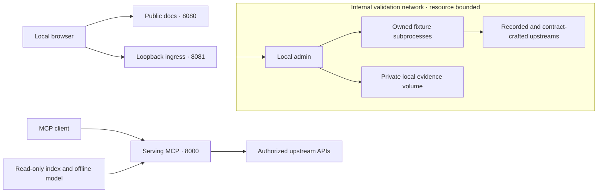

# Local companion containers

Public documentation, local validation administration and the serving MCP are independent
processes. The approved NCI-styled documentation includes topic and user-story pages; it
contains no operational results.

## Build and start locally

Use Python 3.14+, PDM, Node.js 24 and a Docker-compatible engine with Compose. Images currently
target Linux amd64; the Dockerfiles do not bake in an architecture. On Apple Silicon, the engine
needs amd64 emulation. No registry login or institutional account is required.

On macOS, projects may share one authorized Podman VM. Use separate, explicitly named
Compose projects, networks and volumes; do not reuse another project's containers or assets.
Select the intended Docker context with `DOCKER_CONTEXT` for builds, Compose and the smoke
check, and confirm its endpoint with `docker context inspect "$DOCKER_CONTEXT"`. Do not
stop unrelated workloads, change shared VM settings or run a global prune during cleanup.

Commit source changes first: the worker archive, application wheels and public documentation
must identify the same clean checkout. No Git metadata or host credentials enter the contexts.

```bash
pdm install -G docs
npm ci --prefix docs/site-assets --ignore-scripts
npm run build --prefix docs/site-assets
pdm run python -m scripts.companion_context
docker build --platform linux/amd64 --load -t nci-si-docs:local tmp/companion-context/docs
docker build --platform linux/amd64 --load -t nci-si-admin:local tmp/companion-context/admin
docker compose -f container/compose.local.yaml up -d
```

To reuse an already browser-tested public site, pass `--site tmp/docs-site` to
`scripts.companion_context` instead of building it again. Its `build.json` must name the
same clean source commit; missing, mismatched, dirty or symlinked input is rejected.
CI downloads that run's documentation artifact for this input, with no fallback rebuild.

Open documentation at `http://127.0.0.1:8080/` and administration at
`http://127.0.0.1:8081/`. Ports are fixed to preserve the exact local Host/Origin boundary.
Stop another listener if either is occupied; do not widen publication to all host interfaces.
Both services expose their own `/health`. They run as UID/GID 65532 with read-only roots,
dropped capabilities, process/memory/CPU limits and explicit temporary storage. Diagnostics go
to stdout. The admin evidence volume persists between restarts; queued or active runs interrupted
by restart are recorded as interrupted and are never retried automatically.

The admin container offers only fixture acceptance and benchmark profiles. Owned disposable
subprocesses share its bounded resource allocation and internal network. It has no serving
MCP network, index/model volume, production credential, Docker socket or external network route.
A small ingress relay publishes port 8081 on host loopback and forwards bytes only to
`administration:8081`; request headers cannot select its destination. It has no evidence
volume or serving network. This extra process supports Docker engines that do not publish
ports for containers attached only to an internal network, without giving workers egress.
Use the separately documented host CLI for explicitly authorized remote probes. This composition
does not test production latency. Missing configuration is shown as unavailable; optionally mount
an explicitly selected safe `serve --configuration-snapshot` artifact read-only at
`/configuration/target.json`, readable by UID 65532. Never mount an environment file or index
there. Proposals remain advisory; the admin container cannot apply them or restart the MCP.

## Serving MCP alongside the companions

Build the existing `nci-si-mcp:verified` image using the [container runbook](container.md).
The MCP compose service explicitly selects `NCI_SI_HTTP_AUTH_MODE=trusted-local` and publishes
only on `127.0.0.1:8000`; the image itself defaults to required authentication. Its `/ready`
healthcheck verifies the local index/model, not upstream availability, with a 180-second startup
grace. Do not expose this opt-out beyond the trusted local deployment.
Set `NCI_SI_LOCAL_INDEX` and `NCI_SI_LOCAL_MODEL` to absolute directories containing a compatible
completed index and offline model, readable by UID 65532, then:

```bash
docker compose -f container/compose.local.yaml --profile mcp up -d
```

The optional MCP service has its own network with upstream egress and read-only model/index
mounts. Its required-index and offline-model startup checks still apply. It is not enabled by
default because this repository does not distribute a production index or embedding model.
No companion receives those assets. Configuration and secrets for real upstream connections
belong to the serving service's deployment environment, not the validation container.



Text alternative: the browser reaches separate docs and admin listeners. Fixture workers and
evidence share only the internal validation network; they have no connection to the serving
MCP. The serving process alone mounts its index/model and connects to authorized upstream APIs.
The fixed admin relay bridges local browser ingress to the internal network without a
configurable proxy target or operational storage.

## Verification and lifecycle

CI builds both images, runs a real fixture benchmark, checks network and mount isolation,
tests that stopping administration leaves a separate MCP healthy, and retains vulnerability
reports and CycloneDX SBOMs. The existing scan gate requires zero High and zero Critical findings.
These local images are not published as new GHCR packages. The hash-locked companion dependency
file is derived from `pdm.lock`; regenerate with `pdm run python scripts/companion_lock.py write`
when the relevant lock groups change. Model and embedding runtimes are excluded.

```bash
docker compose -f container/compose.local.yaml --profile mcp down
```

This preserves evidence. Add `--volumes` only when deliberately deleting that local history.
Remove `tmp/companion-context` after image construction; a rebuild requires a fresh output
directory (or `--output` with another path). Do not delete a directory someone else uses.

## UAT/PROD blueprint

Deploy public static documentation and MCP independently using the platform's ingress, HTTPS,
health monitoring, resource limits, secrets and logging facilities. Documentation stays anonymous.
Keep admin services, routes, worker credentials and result stores **absent** until the platform supplies
authentication plus explicit maintaining-team authorization on both ingress and origin.
No proxy header or environment switch in this repository establishes that protection;
[deployment.md](deployment.md) records where administration may be exposed.

The local Compose file is not a UAT/PROD deployment manifest. Cloud One infrastructure,
identity/authorization configuration, records retention, backup and promotion are platform/owner
decisions. This blueprint provisions nothing, changes no repository visibility or settings, and
adds no AWS credentials, ECR publication or independent identity service.
