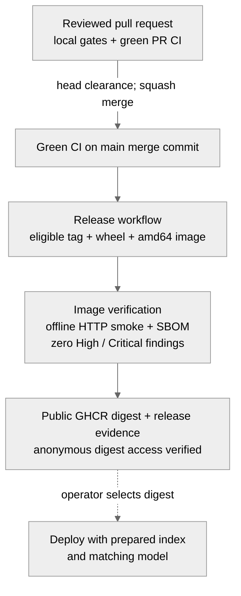

# Container operation

The prototype image is cloud-neutral and CPU-only, initially Linux amd64. Cloud One's
production design remains with the hosting team: no AWS credentials, roles, infrastructure
or identity provider are configured here. The default image **requires authentication** and
refuses startup without the approved identity integration configured through the
[transport hooks](transport.md#authentication-and-authorization-hooks).
The [deployment diagrams](deployment.md) show local stdio, a local container, and the proposed
Cloud One layout, including storage, network and session boundaries.

## Start with external assets

Copy a completed index directory to **local writable storage** before starting the server.
Preserve the whole SQLite database, including the active build and its retained predecessor;
use a consistent backup, not a copy of a live database without its journal/WAL. Do not share
the serving database over a network filesystem. SQLite opens transactions and may need
journal/WAL files beside `nci_si.sqlite3`; UID/GID 65532 must be able to write this directory.
Serving never builds or activates an index.

Supply the embedding model separately in a read-only Hugging Face cache mounted at
`/model-cache`. `NCI_SI_EMBEDDING_MODEL` must retain the model identity in the index manifest,
not a new path to the same weights. If the index was built using a local model path, mount
the model at that same path. The image sets `HF_HUB_OFFLINE=1` and `TRANSFORMERS_OFFLINE=1`;
the container entry point additionally requests local files only. Missing or incompatible
assets fail startup with one JSON diagnostic identifying the asset and error class.

Use the digest recorded on the GitHub release, for example:

```bash
docker run --rm --read-only --stop-timeout 20 --cap-drop=ALL --security-opt=no-new-privileges \
  --tmpfs /tmp:rw,noexec,nosuid -p 127.0.0.1:8000:8000 \
  -v "$INDEX_DIR:/data" -v "$MODEL_CACHE:/model-cache:ro" \
  --env-file "$SERVER_ENV" "$IMAGE_DIGEST"
```

The environment file is supplied by the operator, never built into the image. It must configure
the approved `NCI_SI_HTTP_AUTH_FACTORY` integration, or explicitly set
`NCI_SI_HTTP_AUTH_MODE=trusted-local` for a trusted local deployment with loopback-only publishing
(`-p 127.0.0.1:...`, as above). Otherwise startup refuses before listening with
`Required HTTP authentication needs an installed integration factory`. Host allow-lists are
not authentication: a reachable client can supply an allowed Host header. Set the
model identity, upstream endpoints/credentials and the public Host/Origin allow-lists
from [QUICKSTART](../QUICKSTART.md#settings). The model needs no download access; runtime
upstream requests still need egress to their configured origins. No live caDSR capability
requiring CDE Match or the lists-of-values API is claimed before credentials are issued.

The image presets HTTP on `0.0.0.0:8000`, required authentication, stateless sessions and
required-index readiness.
All are environment defaults that operators can override; the application's ordinary
defaults remain unchanged. Bind address does not disable Host/Origin checks. `/health`
checks the serving process; `/ready` verifies the active index and model locally. Neither
asserts upstream availability. The image's HEALTHCHECK requests `/health`; local compose uses
`/ready` instead. Both use the configured HTTP port, a three-second request bound, 30-second
interval, five-second probe timeout, 180-second startup grace and three retries. The startup
grace matches the smoke's model/index startup allowance; increase it for larger cold assets.
If overriding `NCI_SI_HTTP_ALLOWED_HOSTS`, retain `127.0.0.1:*` for these internal probes; they do
not bypass Host admission or need credentials. JSON diagnostics go to stderr, collected by container log
drivers; stdout remains reserved for MCP when stdio is explicitly selected.

Stateless calls can reach any replica and resolve omitted NCIt releases per call. Name a
release explicitly when calls must agree. Stateful handshake sessions require routing each
session ID to its owning process; another process returns 404. Restart or 30-minute idle
expiry loses the pin, and reinitialization can select a newer release. Single-exchange
protocol calls have no session even in stateful mode. See [session details](transport.md).
The server runs as PID 1 with an exec-form entry point; allow 20 seconds for graceful SIGTERM.

Build, evaluate and activate indices as separate operator jobs using the existing
[index commands](../QUICKSTART.md), then distribute consistent snapshots to serving replicas.
To roll back, activate the retained predecessor in the operator copy, verify its manifest,
and replace/restart serving replicas with that snapshot. Coordinate the rollout; the image
does not synchronize local files or sessions across replicas.

## Build and release evidence

### Release pipeline

The image and its external data/model assets have separate lifecycles. This repository's
pipeline publishes the image; the operator prepares assets and chooses when to deploy it.



PR builds never publish. A successful tag/release job alone does not imply successful image
publication: the image job must finish too. Audit and CodeQL also run on main; neither replaces
the image scan. [Publication recovery](#scan-policy-and-publication) is described below.

### Local builds and dependency lock

Run `pdm build --no-sdist` in a tagged checkout, then
`docker build --platform linux/amd64 -t nci-si-mcp:local .`.
With Podman, use `podman build --format docker` to preserve the image health check.
Keep exactly one current wheel in `dist/`. Run
`pdm run python scripts/container_smoke.py nci-si-mcp:local` to check the image with an
external, test-only model and a recorded concept. CI builds the same wheel/image and runs
the same smoke check, including default-auth refusal, explicit local serving and Docker's
healthy status. This is packaging evidence, not production retrieval calibration.

The image uses a digest-pinned Amazon Linux 2023 base, refreshes OS packages and installs
its `python3.14` package. The builder creates a virtual environment on the same base and
copies it into the runtime; builder package installations and caches stay behind.
The Dockerfile accepts a requirements
path as a build argument so an additional architecture can be added later. To regenerate
the amd64 CPU lock from `pdm.lock`:

```bash
pdm run python scripts/container_lock.py prepare tmp/container-lock
docker build --platform linux/amd64 -f container/Dockerfile.resolve --output type=local,dest=tmp/container-lock/report tmp/container-lock
pdm run python scripts/container_lock.py write tmp/container-lock/report/resolution.json
pdm run python scripts/container_lock.py check
```

Remove `tmp/container-lock` afterwards. Installation requires hashes. The check fails if
PDM runtime versions drift; ordinary developer dependencies are unchanged.

### Scan policy and publication

The initial [candidate scan evidence](../container/base-scans.json) records image identities,
scanner metadata and every High finding. On 6 October 2026, Python slim-trixie
had 48 High/0 Critical findings, unchanged after OS and pip upgrades. Both Chainguard's
minimal glibc Python base and the upgraded AL2023 Python base scanned at zero, as did
each base with the CPU dependencies. AL2023 was selected to match CBIIT services and
its hardened base, with retained pullable digests. Chainguard's free tier offers moving
`latest` tags and does not guarantee old pinned digests remain pullable.
These are point-in-time results;
each complete release image is scanned again.

The Release workflow chains image build, smoke tests, SBOM and vulnerability scanning before
GHCR publication. The image path is derived from `github.repository`, so moving the repository
changes the namespace without a code change. PR jobs never publish. Every HIGH or CRITICAL
finding blocks publication, even without an available fix. There are **no exceptions**;
any future exception needs an explicit owner decision recorded with its name, date and reason
in a tracked file and reviewed in its PR. Public Trivy scans are a proxy, not a claim that
NCI's inaccessible Twistlock/Prisma Cloud scanner has approved the image.

[GitHub creates new GHCR packages as private](https://docs.github.com/en/packages/working-with-a-github-packages-registry/working-with-the-container-registry)
even for public repositories. At first publication
(and after an organization move), set the package's visibility to public in its package
settings. The workflow verifies anonymous access to the exact digest and fails until that
works. If the GitHub release exists but the image job failed, correct the cause and rerun
Release with `retry_image_tag` naming that release at the current main commit. Security
reports are attached before the public-access check; a successful run adds the digest and
evidence references to the release notes. Use the digest to deploy, not a floating tag.

CBIIT's hardened bases are in private ECR unavailable to public CI. The hosting team may
rebuild on its approved `cbiit-amazon-linux-2023` base. Cloud One ECR publication and OIDC deployment roles are later
deployment work; this issue supplies public GHCR images only.
