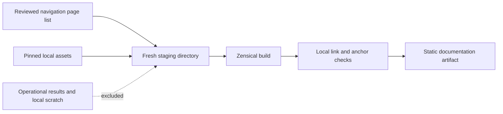

# Public documentation website

The website presents the repository's existing documentation, behavioral stories and Mermaid
diagrams as a searchable static site. It is public, requires no account, and has no connection
to the MCP process or an operational results store. Local use requires no institutional login.

## Build and preview

From the repository root, with Python 3.14+, PDM and Node.js 24 / npm installed:

```bash
pdm install -G docs
npm ci --prefix docs/site-assets --ignore-scripts
npm audit --prefix docs/site-assets --audit-level high
npm run build --prefix docs/site-assets
pdm run docs-build
pdm run python -m http.server 8000 --bind 127.0.0.1 --directory tmp/docs-site
```

The build records the installed package version, which `pdm install` derives from the nearest
tag: on a clone without tags, run `git fetch --tags origin && pdm install` first, or the build
refuses the development fallback version.

Open `http://127.0.0.1:8000/`. Stop the preview with Ctrl+C. Builds require a new output
directory: for another preview use `pdm run docs-build --output tmp/docs-site-next`, or remove
your previous generated directory after stopping its preview. Existing output is never deleted
by the builder. No GitHub Pages, DNS or cloud settings are changed by these commands.

Zensical is pinned in the docs development group in `pdm.lock`. Mermaid is pinned separately
in `docs/site-assets/package-lock.json`; npm lifecycle scripts are disabled. Neither is a core
MCP runtime dependency. The explicit build command uses pinned esbuild to bundle Mermaid's
external-dependency entry point with the KaTeX 0.18.2 override. It does not copy Mermaid's
prebuilt browser bundle, which embeds an older KaTeX despite a clean dependency audit.
The override addresses [GHSA-238p-pmpm-9mq7](https://github.com/advisories/GHSA-238p-pmpm-9mq7);
remove it only when the selected Mermaid release resolves a patched KaTeX on its own.
Rebuild after every `npm ci` or dependency change; the site build fails if the rebuilt asset
is missing. Bundled dependency license notices are published alongside the runtime.
After dependency updates, copy `docs/site-assets/test-mermaid.html` into the root of a
disposable copy of the built site and serve it over loopback HTTP. Open that test page and
require all six checks to pass: flowchart, sequence, state, entity relationships, mathematical
labels (powers, fractions and roots), and rejection of untrusted mathematical links. Also
inspect the architecture and deployment pages visually. The test page is not part of the
publication allowlist; remove the disposable preview after testing.
The site serves its diagram runtime, stylesheet, fonts and
search assets locally; external references remain ordinary links. Repository README badges
become text links in the site, so browsing documentation does not fetch third-party badge images.
Serve the artifact over HTTP; direct `file://` search is not a supported preview mode.

The Zensical theme override uses the [NCI Design System color tokens](https://designsystem.cancer.gov/foundations/color)
and [typography](https://designsystem.cancer.gov/foundations/typography): Poppins headings,
Open Sans body text and Roboto Mono code. Font files and their upstream licenses are vendored
under `docs/site-assets/fonts`; `sources.json` records the pinned source revision and SHA-256
digests. No browser request to a font provider is needed. The compact blue footer retains
agency and policy links, identifies this prototype, and links to project maintainers without
social media widgets. Edit `main.html` and `site.css` there, then rebuild; the template itself
is not a standalone web page.
On wide screens, the native Zensical search control sits above “On this page.” It returns
to the header when the right sidebar is hidden; the same control retains its keyboard shortcut.

Behavioral stories use three levels: a six-topic overview, a topic page of user-story cards,
and one page per story. The complete generated Markdown catalogue remains the source; the
site build partitions it without changing the narratives, requirement links or exact case IDs.
Individual case IDs stay inside expandable evidence sections. Tests reject omitted or duplicate
stories and inconsistent case counts, and verify that every case survives exactly once.
Existing story anchors on the catalogue still lead to the corresponding story page.

## What can be published



Text alternative: the builder copies only the Markdown pages named in the reviewed navigation
and the explicitly listed assets into fresh staging. Zensical builds that staging; local link
and heading checks must succeed before the output directory is created. Operational results
and scratch files are never copied. Public repository source references remain links to the
source commit, rather than turning the target files into site downloads.

`docs/site-assets/zensical.toml` is both navigation and the page allowlist. Do not replace it
with a recursive copy of `docs/`, test reports, workspaces or mounted data. Tests plant canaries
in excluded Markdown and JSON files and scan **every generated file**, including the search
output, to prevent accidental publication. Approved pages themselves must contain only public
documentation. This is a publication boundary, not a secret detector.

## Version and accessibility

The banner and `build.json` name the source commit, development/release channel and whether
the source tree was modified. Installed package version is recorded separately. A release
label is accepted only with `--release-tag vX.Y.Z` when that tag resolves to the clean source
commit. An installed version alone does not establish a release. Relative navigation and assets
allow the artifact to be mounted at a versioned URL prefix without rebuilding it. The host
supplies error pages; the artifact omits the generator's root-specific 404 page.

Pages retain semantic headings, links and tables in static HTML; essential documentation is
readable without JavaScript. Search and rendered Mermaid diagrams require JavaScript. Diagrams
retain adjacent prose descriptions, and focus outlines and reduced-motion styling support
keyboard navigation. Browser checks cover navigation, search and diagrams; the Phase 7 assurance
issue covers the complete accessibility matrix. This is not a WCAG certification claim.

## Deployment boundary

Each CI run builds a separate `documentation-preview-<commit>` artifact with a 30-day lifetime.
It contains only the checked static site, never validation reports or the local evidence store.
The companion image job consumes this same-run artifact rather than rebuilding it. The
documentation producer runs on every PR; a missing or unsuccessful producer cannot be
silently replaced. CI caches Playwright's browser binaries by runner and dependency lock,
but installs Linux system libraries on every run; cache reuse is not a promised speedup.
Download and serve it over HTTP to review that commit. Uploading this artifact neither deploys
a website nor promotes pull-request content into a release. The lifetime is an engineering
retention setting, not an agency records schedule.

The documentation artifact can be served by an ordinary static host or a separate companion
container. The [local results dashboard](local-validation.md) uses a separate loopback listener;
controls, benchmark results and advisory configuration views are available locally. The
[companion containers](companion-containers.md) package the two services separately.
UAT/PROD administration is disabled ([deployment.md](deployment.md) records where it may be
exposed). Documentation
remains anonymous. The repository's public status and upstream EVS/caDSR access controls are unchanged.
