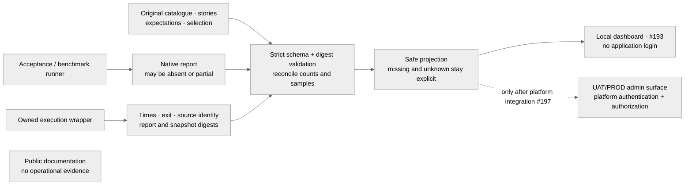

# Validation run evidence

The [Phase 7 companion plan](portal-plan.md), issue
[#191](https://github.com/CBIIT/nci-si-mcp/issues/191), changes no MCP record or tool.

All local features work for repository users without application login. Public engineering CI
remains public. Only UAT/PROD administrative instances require platform authentication and
explicit maintainer authorization; public documentation remains anonymous. Upstream systems
retain their access rules. The envelope's access label classifies its deployed administrative
surface; it is neither an authentication mechanism nor a restriction on local developer use.

## Run envelope version 1

`scripts/evidence_envelope.py::validate_envelope` validates UTF-8 JSON metadata and binds it to
separately supplied report bytes. A wrapper records metadata independently of the report.
Consumers must establish the producer's authority through their execution/storage boundary;
this validator does not authenticate it. A checksum proves byte agreement, not trusted origin,
deployment authorization or a passing test result.

| Field | Value and meaning |
| --- | --- |
| `schema` | Integer `1`; booleans and other versions rejected |
| `access` | `maintainer-admin`: deployed admin classification; local access needs no login |
| `run_id` | 32 lowercase hexadecimal characters assigned by the wrapper |
| `kind` | `acceptance` or `benchmark` |
| `runner_commit` | 40 lowercase hexadecimal characters identifying runner source |
| `catalogue_sha256` | Digest of reviewed case inventory and attribution at its original revision |
| `stories_sha256` | Digest of that revision's story mapping |
| `expectations_sha256` | Digest of its expected outcomes, not today's expectations |
| `selection_sha256` | Digest of the exact selected inventory, not just a count |
| `started_at`, `finished_at` | ISO timestamps with `T`, seconds and offset; finish cannot precede start |
| `state` | `completed`, `failed`, `cancelled`, `interrupted` or `unavailable` |
| `exit_code` | Integer 0–255 or null when unknown; never bool/float |
| `report_sha256` | SHA-256 of exact report bytes; null only when no report exists |
| `server_commit` | Separately recorded server source commit or null; never inferred from the suite |

Every field occurs exactly once. Unknown fields, duplicate keys and nonfinite numbers fail,
including finite-looking JSON exponents such as `1e400` that overflow the parser's float.
SHA-256 values contain 64 lowercase hexadecimal characters. No arbitrary labels, paths, URLs,
credentials, result bodies or assertions of trust belong here. Limits are 64 KiB envelope and
16 MiB report bytes. File readers enforce limits during reading, before unbounded allocation.
Errors do not echo rejected values.

Completed means zero process exit and an available report, **not** a passing or complete test
inventory. Failed requires a known nonzero exit, with or without a report. Cancelled/interrupted
may retain a partial report and unknown exit. Unavailable has no report. Client cancellation
never proves remote server termination. An absent report must not become zero tests passed.

The envelope and native acceptance/stdio/HTTP benchmark projection libraries are implemented. They
introduce no MCP endpoint or authentication service. Dashboard import/storage is #193; the
execution wrapper and process lifecycle are #199. Historical metadata remains unknown rather
than being synthesized from upload time. A historical report without a recorded envelope and
original snapshots must be displayed as an unverified import, not passed to these validators
with invented execution facts.

## Projection and comparison requirements

Adapters validate native report schemas before projecting summaries, preserving harness
outcomes, selected/missing/unrun cases and original inventory/story/expectation identity.
No raw exceptions, unmatched URLs, tool bodies or secrets are copied. A plausible report from
an interrupted process never becomes a complete run.

Benchmark projections separate client duration/status/size from unknown server telemetry.
Do not invent zero attempts or cold-cache state. Compare fingerprints covering mode/transport,
definitions, workload/profile, release/index/model, hardware/environment/client placement and
warm-up/sample/concurrency/timeouts. Unknown or incompatible data blocks dependent claims.
Show errors/sample counts with latency; this is not automatically SLO or capacity evidence.

### Acceptance projection

`scripts.evidence_acceptance.project_acceptance` takes the envelope, native report bytes (or
null), and four original UTF-8 JSON snapshots. Each snapshot is bounded to 16 MiB and its exact
bytes must match its envelope digest. Formatting changes therefore change the binding.

| Snapshot | Contents |
| --- | --- |
| `catalogue` | `schema: 1`, `suite_digest`, original `tools` map of names to groups, and `cases` map of exact parametrized node IDs to `{tool, gate}` |
| `stories` | Every original catalogue node ID mapped to its original story ID; narrative text stays in the versioned documentation |
| `expectations` | Every original catalogue node ID mapped to its expected harness outcome |
| `selection` | Nonempty, unique list of the exact selected catalogue node IDs |

The report's suite digest, case attribution, gate lists, counts and tool outcomes are checked
against those snapshots and individual results. Tool outcomes reuse the acceptance harness's
`tool_outcome`; this adapter does not redefine PASS or the fixture ratchet. Historical tool
inventories come from their original catalogue, not today's registry. Native alias-null reports
cannot distinguish an unstarted server from an unimplemented tool; the adapter preserves that
ambiguity. Raw aliases, suite labels and unmatched URLs are omitted from the projection.

Each projected case carries a SHA-256 node ID, original story ID, expected/actual outcome and
tool/gate attribution. The dashboard displays the original story ID, rather than substituting
today's narrative for historical evidence, and never treats node IDs as file paths or markup.
Missing cases have a null outcome.
`inventory_complete` means all selected cases were recorded in a terminated completed/failed
run; **it does not mean all passed or ran to a verdict**. Skipped cases and failed processes
remain visible. With no report, counts and tools are null, not invented zeroes.
Reports carrying `run` also require the shared `nci_si_acceptance.report.complete` predicate:
status 0 or 1, no worker crash, and matching selected, finished and recorded-outcome counts.
The native schema accepts its existing fields with or without `run`. Phase 5 recordings and
older imports without `run` retain the independent selection-bound check alone; historical
completion fields are never invented. Partial evidence can be projected without being complete.
The run page shows tool verdicts only when `inventory_complete` is true. Otherwise it reports
the number of selected cases without an outcome and explicitly withholds verdicts; recorded
case outcomes remain visible, including when a crash leaves no cases missing.
The notice also names the harness's completion failure (such as a worker crash or run exit
status). Historical evidence names missing selected outcomes, or the recorded execution
state when none are missing, so zero missing cases cannot conceal why a verdict was withheld.

### Benchmark projection and comparisons

`scripts.evidence_benchmark.project_benchmark` supports the existing native **stdio** format
and dispatches explicitly versioned **HTTP** reports to `scripts.evidence_http`.
It recomputes every cold/warm summary from finite nonnegative samples, checks error flags against
response codes, repetitions, unique expected cases and completion. Both successful and failed
calls contribute to nearest-rank p50/p95. Errors, sample counts and timing samples are retained;
arguments, arbitrary labels, release text and machine names are not displayed. No-report runs
have null cases, not a zero-error result. Measurements are bounded to signed 64-bit magnitudes.
Relabelling stdio evidence as HTTP fails. HTTP schema 1 requires campaign limits, termination
state, admitted HTTP request count, target digest, ordered expected cases and three phases:
first call in a new client session, warmed calls and separately recorded warm-ups. Limits,
summary arithmetic, unique correlations, phase counts and request totals are checked. A client
failure can have unknown result size; successful replies cannot. Server attempts/cache/commit/
replica remain null. Neither native completion nor a completed envelope can conceal missing
measurements. Target URL, case arguments and raw response content are not projected.
Older benchmark files without `expectedCases` (including the committed Phase 5 interrupted
example) are not upgraded by guessing the missing inventory; #193 presents them as unverified
historical imports. Regression tests also exercise both complete committed Phase 5 reports.

An optional independently recorded `selection` JSON snapshot contains `schema: 1`, `cases`
(`tool`, `arguments`, `scenario`) and `fingerprint`. Its bytes bind to `selection_sha256`; its
case definitions must agree with the native report. All 15 fingerprint dimensions below must
be present with a SHA-256 value or null. Values are digests of compact, sorted-key JSON
(`fingerprint_value`), not labels containing raw configuration or credentials.

`mode`, `transport`, `definitions`, `workload`, `profile`, `release`, `index`, `model`,
`hardware`, `environment`, `placement`, `warmup`, `samples`, `concurrency`, `timeouts`.

The adapter independently recomputes mode, transport, conditions/definitions, observed workload
and repetitions. For a partial report it checks each observed case against the full independent
selection and fingerprints that plan; it never mistakes missing cases for completion.
Other facts require the wrapper's actual knowledge. Use null when unknown;
do not hash "unknown" to manufacture comparability. A known absence (for example, no index)
is distinct from unknown and can be recorded by the wrapper. Without the independent selection,
`selection_verified` and `comparison_ready` are false. `comparable` lists differing/unknown
dimensions, unverified selection and incomplete execution rather than offering a speedup.
Agreement establishes comparison conditions only, not authenticity, SLO compliance or capacity.

### Evidence flow

Text alternative: the wrapper records execution independently, the runner produces native
results, and the validator checks both against original snapshots. Only the projection enters
the local dashboard. UAT/PROD administration additionally needs the platform boundary; public
documentation never consumes operational result records. The wrapper, validators and local
dashboard are implemented; deployed platform integration remains deferred.

The standard `pdm run test` and CI coverage measurement include these evidence modules alongside
the core server. The existing 90% floor and above-95% aim apply; these are regression tests for
observable validation and projection behavior, not a separate relaxed portal threshold.

The public documentation build excludes operational UAT/PROD records from pages, search indexes
and downloads. Local result browsing has no login requirement. A shared UAT/PROD deployment must
protect all admin metadata, artifacts and actions through the approved platform integration
before exposing them; [deployment.md](deployment.md) records where that may happen. No repository visibility change is needed.
