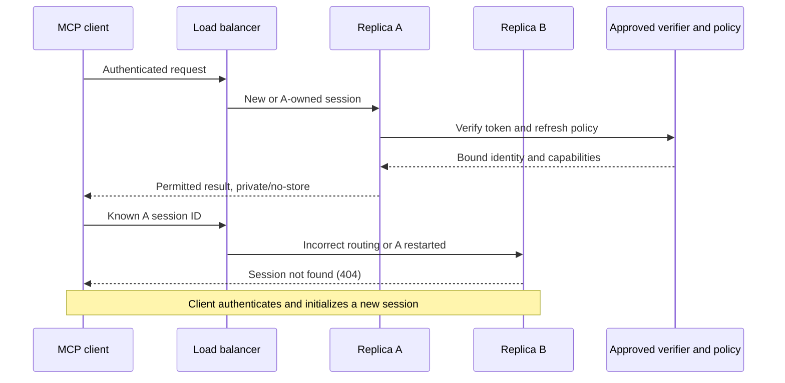

# Governed HTTP access

This is portable integration support with fixture evidence. Production identity and Cloud One
deployment remain **disabled and unvalidated** until the security/hosting owners approve them.

The stock entry point uses one `/mcp` endpoint. Local development defaults to `trusted-local`.
For a governed deployment set `NCI_SI_HTTP_AUTH_MODE=required` and
`NCI_SI_HTTP_AUTH_FACTORY=approved_package:integration`, then run
`nci-si-mcp serve --transport streamable-http`. The factory is trusted, installed Python code:
only the operator may configure it. An absent or incomplete integration fails before listening.
Required HTTP configuration cannot silently launch unrestricted stdio.

The factory receives `Settings` and returns `HTTPAuthIntegration(auth, token_verifier,
authority_resolver)` from `nci_si_mcp.http_auth`. It supplies:

- SDK `AuthSettings` with the approved issuer, resource-server audience, required transport
  scopes, and `validate_token_resource=True`.
- An SDK `TokenVerifier` implementation using the approved provider/library to verify tokens.
  It must return the verified issuer in `claims['iss']`, subject, client, resource and finite
  expiry. If tenant applies, normalize its verified value to `claims['tenant']`.
- An asynchronous policy resolver returning the immutable authority described in
  [caller permissions](caller-permissions.md). Its principal must exactly match that verified
  token's issuer, subject, tenant and client. Missing/mismatched policy denies access.

The module does not implement OAuth or JWT cryptography. It additionally checks issuer and
expiry; the SDK checks resource audience and scopes. Missing/invalid credentials produce 401,
insufficient transport scopes 403, and operation/policy refusals `permission_denied`. No inbound
token is forwarded to EVS, caDSR or Shared SI; their service credentials remain separately
configured and origin-bound. Service credentials do not establish caller delegation.

`/health` and `/ready` are public status-only probes, still protected by configured Host/Origin
admission. All governed HTTP responses are `Cache-Control: no-store`. Forwarded identity headers
grant no authority; Uvicorn proxy-header interpretation stays off. Set the actual external
Host/Origin allowlists. An approved TLS/network proxy must pass bearer authentication through;
this implementation does not accept proxy assertions of user identity.
Deployment also needs [gateway limits and timeouts, and network egress controls](container.md#gateway-controls-and-outbound-access);
authentication alone does not provide these controls.

Stateful sessions and their first implicit NCIt release belong to one process. The load balancer
must keep known session IDs on their owner. Another replica or a restarted owner returns 404;
it does not silently recreate the old pin. A different principal cannot reuse the session.
An explicit release does not change its implicit pin. Security configuration changes require
session invalidation and client reauthentication.

Stateless and the SDK's single-exchange requests hold no multi-call pin: each request verifies
authority and resolves an omitted release. Supply an explicit release for a consistent task
across calls or replicas. There are no alternate MCP endpoints or cross-endpoint session IDs.

For rollback, retain required mode and the approved integration. Do not roll a secured service
back to a version that lacks this startup guard; keep it unavailable or maintain an independently
approved authentication boundary. Never restore availability by switching to trusted-local.

Before production enablement the owner must approve issuer/audience, tenant/client mapping,
capabilities, transport scopes, revocation freshness, provider secrets and retention, TLS/proxy
trust and routing. Local doubles and fixture upstreams validate mechanics only; they do not
establish production identity or live caDSR readiness.
