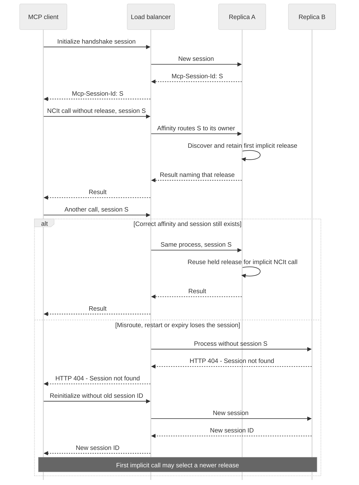

# Remote transport

Run `pdm run nci-si-mcp serve --transport streamable-http` and connect an MCP client to
`http://127.0.0.1:8000/mcp`. Plain `serve` retains stdio. The registry, profiles, tools,
resources, prompts, error records and caching policy are shared by both transports.
The [settings table](../QUICKSTART.md#settings) lists bind address, allow-lists and bounds.

## Sessions and several replicas

`NCI_SI_HTTP_SESSIONS=stateful` is the default. For handshake protocols such as 2025-11-25,
the SDK creates a session ID and stores its state in the process that answered initialization.
That state includes the first successful implicit NCIt release resolution (X-22). Explicit
release arguments override only their own calls. A content error does not clear the pin;
withdrawal of that release asks the caller to start a new session or name a release.

Route a known `Mcp-Session-Id` to its owning process. Another replica returns HTTP 404 with
the SDK's `Session not found` error; it does not accept the ID as a new session. Use one
worker per replica and session affinity when choosing this mode. The SDK expires idle
sessions after 30 minutes and caps each process at 10,000 sessions (`session_idle_timeout`
and `max_sessions`, passed explicitly). A client returning after expiry gets HTTP 404.
Restarting the process
also loses its sessions. Reinitialize after session loss; the new session can select a newer
implicit release. There is no distributed session store or transparent session migration.

Use `NCI_SI_HTTP_SESSIONS=stateless` behind a load balancer without affinity. Either replica
can answer a call. Omitted releases resolve independently on each call, and every result
names the effective release. Name a release explicitly when calls must agree across time or
replicas. Implicit results remain uncached/private (0/private); explicitly pinned results keep
their usual cache policy.

The SDK also supports the 2026-07-28 single-exchange protocol. It has no HTTP session or
initialize handshake, even when the server setting is stateful. It therefore resolves omitted
releases per call under X-22. Session affinity cannot create a release pin for that protocol.
Native list/resource cache fields also belong to the 2026 protocol: the SDK removes them for
older clients. Tool hints in `_meta` remain available on handshake protocols.

### Session routing sequence

This sequence applies to **stateful handshake sessions**, not stateless or single-exchange
calls. The load balancer owns affinity; the SDK does not forward an unknown session to another
process. See the [deployment views](deployment.md) for the local and cloud boundaries.

With stateless HTTP, either replica can answer each call and there is no session pin to
recover. Passing an explicit release keeps the requested content version stable; it does not
make an expired stateful session ID valid.

## Admission and readiness

Host and Origin allow-lists remain enabled on all bind addresses and cover health routes too.
The port wildcard does not allow arbitrary hostnames. Configure the public authority at a
reverse proxy; forwarded headers are not trusted automatically. A missing Origin is allowed.
Bodies over the configured cap return HTTP 413 before JSON parsing or tool execution, whether
they declare Content-Length or arrive chunked. Raw HTTP access logging is disabled; application
and HTTP-runner diagnostics are JSON on stderr in both transports.

`GET /health` returns `{"status":"ok"}` when the process answers. `GET /ready` returns
`{"status":"ready"}` or HTTP 503 with `{"status":"not_ready"}`. Neither calls upstream or
discloses settings, paths or credentials. Context initialization opens the database and loads
the configured embedding provider before the HTTP app can serve. If deployment supplies an
index, set `NCI_SI_HTTP_REQUIRE_INDEX=1`: readiness also requires its active completed build
and validates compatibility with the runtime embedding provider/model and field-search schema.
Checks run locally on each readiness probe, so activation or storage failures are reflected.
The first failing probe and each transition from ready to not ready emit one JSON
`http_not_ready` diagnostic naming only the error class. Repeated failing probes do not log.
With the setting at 0, an absent active index permits live tools; indexed tools still fail
explicitly when unavailable. An existing active build is always verified. Readiness does not
claim that upstream services are currently reachable.

## Authentication and authorization hooks

The local default is trusted-local. The [required-auth entry point](governed-http.md) loads an
operator-installed integration with SDK `AuthSettings`, `TokenVerifier` and a caller-policy
resolver. It refuses startup without all three and binds policy to verified token identity.
The SDK enforces audience and required scopes before MCP dispatch; session ownership also
includes the applicable tenant. Embedders can supply these collaborators to `create_http_app`.
This prototype does not choose a production identity provider or store a transport credential.

Missing/invalid credentials return HTTP 401; insufficient scope returns HTTP 403. Refused
requests never reach the registry or emit a tool completion audit containing caller content.
They emit one `http_auth_rejected` JSON diagnostic with the status, without the token or body.

Both Bearer challenges advertise the integration's required scopes and the SDK's protected-resource
metadata URL, following MCP's [scope selection guidance](https://modelcontextprotocol.io/specification/2026-07-28/basic/authorization#scope-selection-strategy).
The metadata names the configured resource, authorization server and supported scopes. It remains
subject to Host/Origin admission. An existing SDK scope challenge is preserved, not duplicated.
Production security approval is required before public exposure. Completion audit remains in
the shared invocation boundary; auth refusal diagnostics contain neither token nor body.

## Reproducing the remote fixture gate

Run `pdm run acceptance-http`. It prepares the exact fixture index, starts the real HTTP server
in default stateful mode, and runs the existing suite serially with its operator state-change
hook. X-22's session cases explicitly use handshake mode; other cases negotiate normally,
including native list/resource cache fields which the SDK omits on pre-2026 protocols.
The server remains in default stateful mode throughout. Every scenario restart keeps the
prepared index and applies the fixture settings. Its
parent process owns and reaps the server; scratch files live under `tmp/` and are removed.
No caDSR credentials or live upstream service are needed.

The report is `acceptance/http-fixture.json`. The gate requires every expected case to be
present and pass, except four `unprepared` cases that the remote contract requires it to skip;
their names and count are printed. The complete stdio ratchet remains separate. The
`acceptance (HTTP fixture)` CI job runs this gate; making it a required branch check is an
owner decision. Production deployment and index operation procedures follow in #121's runbook.
